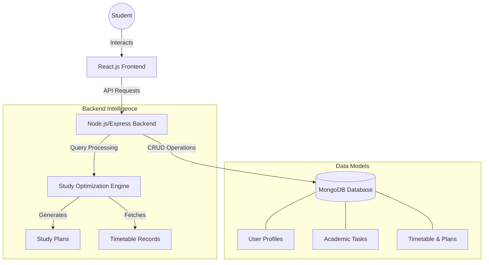

# Hall-o-Flow | AI-Driven Academic Scheduler

Hall-o-Flow is an intelligent college timetable and study planning assistant designed for students to optimize their academic performance through automated scheduling and performance analytics.

## 🚀 Key Features

- **Automated Timetable Management**: Dynamic visualization of college schedules with day-wise filtering.
- **Intelligent Study Planner**: Generates optimized study blocks based on timetable gaps and subject difficulty.
- **Performance Analytics**: Real-time tracking of study completion rates and academic consistency.
- **Study Assistant**: Conversational AI for querying schedules and requesting study optimizations.
- **Dual Aesthetic Themes**: Choose between 'Cyber/Neon' and 'Royal/Obsidian' interfaces.


## 📁 Project Structure

```text
hall-o-flow/
├── backend/                # Express API Server
│   ├── src/
│   │   ├── controllers/    # Business Logic (Chat, Analytics, Schedule)
│   │   ├── middleware/     # Auth & Database connection
│   │   ├── models/         # MongoDB Schemas
│   │   ├── routes/         # API Endpoints
│   │   └── database/       # Seed scripts & Migration logic
│   └── package.json
├── frontend/               # React Single Page Application
│   ├── components/
│   │   ├── layout/         # Navbar, Sidebar, Page Wrapper
│   │   ├── sections/       # Dashboard, Timetable, StudyPlan, Chat
│   │   └── ui/             # Reusable UI components (Buttons, Cards)
│   ├── hooks/              # Custom React hooks
│   └── index.tsx           # Entry point
├── docker-compose.yml      # Container orchestration
├── QUICKSTART.md           # Developer setup guide
└── README.md               # Project documentation
```

## 🛠 Tech Stack

- **Frontend**: React.js, Tailwind CSS, Lucide Icons, Framer Motion.
- **Backend**: Node.js, Express.js, MongoDB (Mongoose).
- **AI Logic**: Day-aware query processing for academic assistance.
- **Environment**: Docker & Docker Compose.

## 🏗 System Architecture


### Use Case Descriptions
- **3.2.1 User Registration**: Seamless onboarding with roll number and department validation.
- **3.2.2 Login**: Secure JWT-based authentication.
- **3.2.3 View Timetable**: Interactive grid with search functionality.
- **3.2.4 Chat with Bot**: Natural language processing for schedule queries.
- **3.2.5 Track Progress**: Visual indicators for low-completion subjects ("Needs Attention").

---
*Developed for the Application Development Laboratory (23Z415).*
